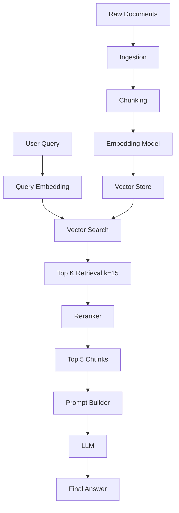
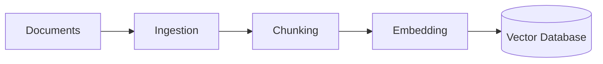
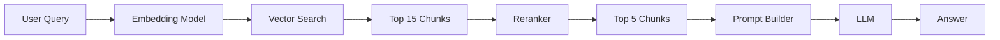
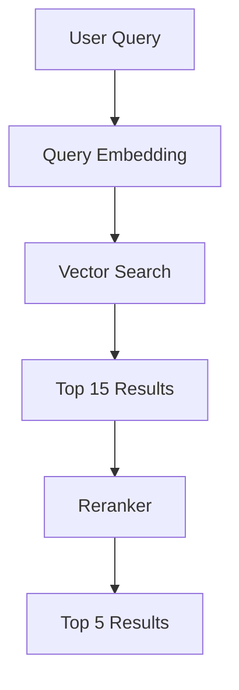

# Basic RAG Pipeline

## Overview

Retrieval-Augmented Generation (RAG) là kiến trúc kết hợp giữa:

- Information Retrieval
- Vector Database
- Large Language Model (LLM)

Mục tiêu là **truy xuất thông tin liên quan trước khi đưa vào LLM** để tăng độ chính xác.

Pipeline gồm 2 phần:

1. Offline Indexing Pipeline
2. Online Query Pipeline

---

# 1. Full RAG Pipeline Diagram



---

# 2. Offline Indexing Pipeline

Pipeline này dùng để **chuẩn bị dữ liệu trước khi hệ thống hoạt động**.



### Steps

1. **Ingestion**

Thu thập dữ liệu từ:

- PDF
- DOCX
- HTML
- Database
- API

Output:

```
Raw Documents
```

---

2. **Chunking**

Tài liệu được chia thành các đoạn nhỏ:

Ví dụ:

```
Chunk size: 500 tokens
Overlap: 50 tokens
```

Output:

```
List[Chunks]
```

---

3. **Embedding**

Mỗi chunk được chuyển thành vector embedding.

```
Text Chunk → Embedding Model → Vector
```

Ví dụ model:

- BGE
- E5
- Sentence Transformers
- OpenAI Embedding

---

4. **Vector Store**

Lưu vector vào database.

Ví dụ:

- ChromaDB
- FAISS
- Pinecone
- Weaviate
- Milvus

---

# 3. Online Query Pipeline

Pipeline chạy khi **user đặt câu hỏi**.



---

# 4. Retrieval Process



---

# 5. Prompt Construction

Context được tạo từ các chunk sau khi rerank.

```
Context:
Chunk 1
Chunk 2
Chunk 3
Chunk 4
Chunk 5

Question:
{user_query}
```

Prompt được gửi vào LLM.

---

# 6. Key Parameters

| Component | Value |
|---|---|
| Chunk size | 300–800 tokens |
| Overlap | 50–100 tokens |
| Retrieval k | 15 |
| Final context | 5 chunks |
| Similarity | Cosine |

---

# 7. Advantages

- Giảm hallucination của LLM
- Tăng độ chính xác
- Không cần retrain model khi cập nhật dữ liệu
- Phù hợp hệ thống QA tài liệu

---

# 8. Use Cases

- Legal QA
- Document QA
- Enterprise chatbot
- Knowledge assistant
- Semantic search